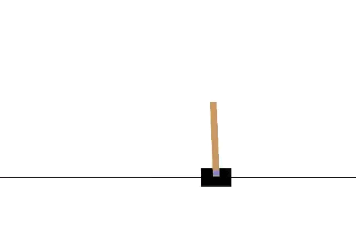
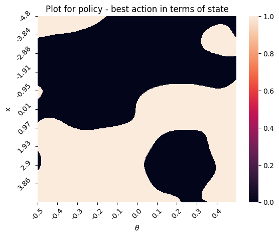
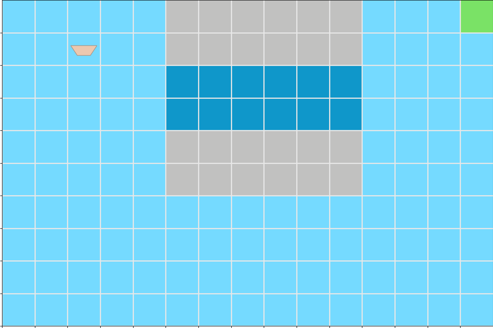

# Reinforcement Learning repository

<br />

<p align="center">
    
</p>

<br />

Place where I do cool stuff with RL.

## First exercise highlights

<p align="center">
    
    
</p>

<p align="center">
    
</p>


<p align="center">
    
</p>


## Second exercise highlights

<p align="center">
    
</p>


<p align="center">
    
</p>

<p align="center">
    
</p>


## Setup

```
pip install -U pip wheel
pip install -r requirements.txt
```


## Run

```sh
WANDB_MODE=disabled \
python train.py \
--config_file_name bipedalwalker_easy \
--agent_name ddpg \
--seed 4 \
--lr 1e-3 \
--gamma 0.98 \
--tau 0.005 \
--batch_size 256 \
--train_episodes 500000 \
--random_transition 10000 \
--buffer_size 200000
```
