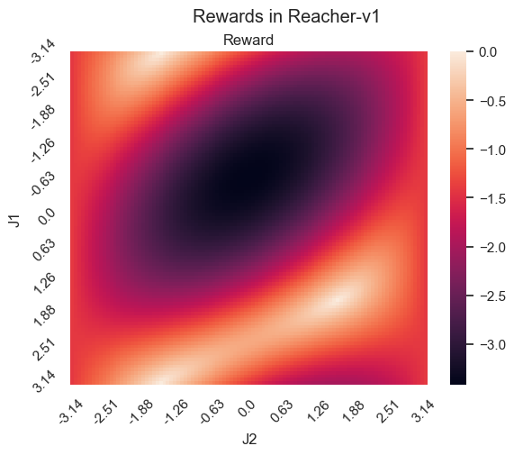

# Reinforcement Learning repository

Place where I do cool stuff with RL.

## First exercise highlights

<p align="center">
    
    
</p>

## Second exercise highlights

<p align="center">
    
</p>

## Setup

```
pip install -U pip wheel
pip install -r requirements.txt
```
